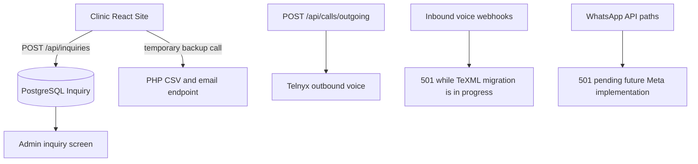

# Communications Flow History And Target Direction

## Status

This directory originally described a phone-to-WhatsApp automation prototype.
That automated flow is not active now. It is retained here as product context
so the intended customer journey is not lost during provider migration.

## Current Implemented Flow

## Preserved Product Intention

The original concept was:

- Decide whether the office is open for an incoming caller.
- Forward open-hours calls to a representative.
- Offer an asynchronous follow-up option when the clinic is closed or the
  representative cannot answer.
- Capture and expose follow-up requests for clinic staff.

The active migration plan in
`../server/docs/TELNYX_TEXML_IVR_IMPLEMENTATION_PLAN.md` refines that intent:

- Telnyx TeXML will provide the future inbound voice flow.
- Closed/no-answer callers may press `9`.
- During the first voice rollout, key `9` is planned to trigger an internal
  email notification for validation, not send a WhatsApp message.
- A later Meta WhatsApp implementation may replace that temporary side effect.

## Superseded Prototype Concept

Earlier drafts envisioned an automatic WhatsApp bot with office-info, message,
and website-link menu options. Do not configure or test that from the current
application; the current `/api/whatsapp/*` routes are deliberately disabled.
