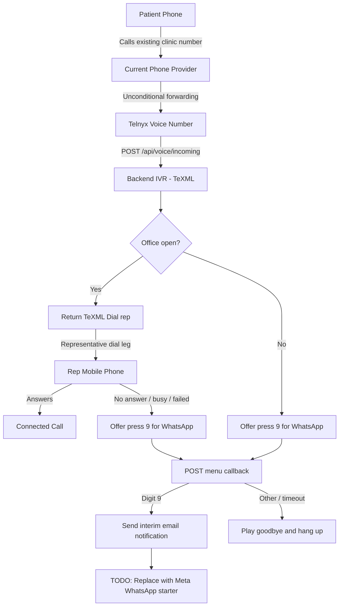

# Telnyx TeXML IVR Implementation Plan

## Purpose

This document is the handoff plan for migrating the clinic phone flow to Telnyx
voice while using email as an interim observable stand-in for the later
WhatsApp starter message.

Decisions already made:

- Use **Telnyx TeXML** for voice IVR, not Telnyx Call Control.
- Use the existing clinic number initially by forwarding it through the current
  phone provider to a future Telnyx voice number.
- Use the existing Google Sheet working-hours logic.
- Use Hebrew text-to-speech via TeXML `<Say>` for the first version.
- The rep mobile number will be provided later through `REP_PHONE_NUMBER`.
- If the office is closed, offer WhatsApp only when the caller presses `9`.
- If the rep does not answer, offer WhatsApp only when the caller presses `9`.
- Do **not** implement WhatsApp now. For validation, pressing `9` sends an
  internal email notification through the existing SMTP integration. Future
  WhatsApp work will replace that notification side effect with Meta WhatsApp
  Cloud API, not Telnyx messaging.
- Remove Twilio completely from the application and documentation during this
  migration; WhatsApp surfaces that cannot function without Twilio will be
  explicitly disabled or left as Meta TODO placeholders.

## Target Call Flow



## Current Repository State

The inbound Telnyx TeXML flow is active through the menu-selection branch:

- `server/ivr/routes.js` handles inbound calls, representative dial callbacks,
  and key-`9` follow-up selection using TeXML.
- `server/integrations/telnyx/voice.js` provides TeXML helpers and normalizes
  TeXML callback fields; it does not initiate standalone calls.
- `server/integrations/email/index.js` sends the temporary internal follow-up
  notification while Meta WhatsApp remains deferred.
- Call persistence exposes provider-neutral call identifiers through
  `provider_call_id` / `providerCallId`.
- The standalone admin/system outbound-call endpoint was removed because the
  product flow only requires patients calling into the IVR.
- WhatsApp endpoints remain explicitly disabled pending the later Meta phase.

## Scope

In scope:

- Inbound Telnyx TeXML IVR webhook responses.
- Open-hours forwarding to the rep mobile number.
- Closed-hours and no-answer phone prompts/menu handling.
- Interim email notification when a caller selects the future WhatsApp option.
- Provider-neutral call ID naming in active voice code.
- Complete removal of Twilio code, configuration, dependencies, identifiers,
  obsolete test paths, and provider-specific setup guidance.
- Documentation and local webhook verification for Telnyx voice.

Out of scope:

- Meta WhatsApp Cloud API integration.
- Any active WhatsApp message sending or inbound WhatsApp bot processing.
- Telnyx WhatsApp or Messaging Profile setup.
- Recorded IVR audio; `<Say>` is used initially.
- Advanced queues, multiple reps, live transfers, media streaming, or AI calls.

WhatsApp boundary during cleanup:

- Existing WhatsApp API endpoints must not continue to send or receive via
  Twilio or Telnyx.
- If the endpoints are retained for API compatibility, they return an explicit
  not-implemented/disabled response pointing to the future Meta phase.
- Provider-agnostic bot conversation logic may be retained only after it is
  moved out of any Twilio-named module or directory.
- The only side effect behind the IVR WhatsApp option in this phase is an
  internal SMTP email for flow validation; it is not a patient-facing message.

## External Setup Needed Later

Coding and local verification can begin without live Telnyx setup. Before real
phone testing, configure:

1. Buy a Telnyx number with voice capability.
2. Create a Telnyx **TeXML Application**.
3. Configure the application inbound webhook:

   ```text
   POST {BASE_URL}/api/voice/incoming
   ```

4. Assign the Telnyx number to the TeXML Application.
5. Configure dialing permissions needed for the IVR `<Dial>` leg to the rep
   mobile number.
6. Configure the existing clinic phone provider to forward incoming calls to
   the Telnyx number.
7. Verify the forwarding path preserves the patient's original caller ID.

Values required for live testing:

```env
BASE_URL=https://public-backend-domain.example
REP_PHONE_NUMBER=+...
IVR_FALLBACK_EMAIL_TO=validation-recipient@example.com
```

The inbound TeXML webhook is driven by Telnyx portal number/application
configuration and the XML response; it does not need a Telnyx API key or Call
Control connection ID in server configuration.

## Implementation Steps

Complete the steps in order. At the end of each step, run its focused checks
before moving on.

### Step 1: Remove Twilio From All Runtime Paths

Goal: begin from a clean provider boundary so new Telnyx and interim email
behavior is not layered on top of working Twilio routes.

Work:

- Remove `twilio.twiml.VoiceResponse` and active Twilio WhatsApp calls from
  IVR routes, temporarily returning explicit unimplemented responses for IVR
  endpoints until TeXML route conversion is completed in later steps.
- Remove Twilio behavior from `server/routes/whatsapp.js` without implementing
  Meta:
  - programmatic send, interactive, location, bulk, send-start, inbound, and
    status webhook routes either become explicit `501` deferred-to-Meta
    placeholders or are removed if nothing consumes them;
  - keep bot inquiry/conversation logic only if moved to a provider-neutral
    service location for future Meta reuse.
- Remove `server/integrations/twilio/` once no active feature imports it.
- Remove Twilio exports from the integrations index.
- Remove Twilio config fields and `isTwilioConfigured()` after all imports are
  gone.
- Remove the `twilio` package from `server/package.json` and lockfile.
- Update server comments that currently label mounted routes as Twilio
  webhooks.

Checks:

- Search all production server code for `twilio`, `Twilio`, `TWILIO`,
  `VoiceResponse`, and `MessagingResponse` and confirm no runtime/config
  references remain.
- Start the server and confirm deferred IVR/WhatsApp endpoints fail clearly
  during the temporary pre-TeXML state without loading missing modules.

### Step 2: Establish TeXML Generation Helpers

Goal: provide one reliable way for routes to build Telnyx XML responses without
changing production route behavior yet.

Work:

- Create or refine a voice XML helper within the Telnyx integration area.
- Support the verbs required by this flow:
  - `<Response>`
  - `<Say>`
  - `<Dial>` / `<Number>`
  - `<Gather>`
  - `<Hangup>`
- Escape dynamic XML content, including message text and attribute values.
- Define Hebrew `<Say>` defaults in one location so the voice can be changed
  later without rewriting routes.
- Do not add audio playback yet.

Checks:

- Generate an open-hours dial response and validate it is well-formed XML.
- Generate a menu response containing Hebrew text and key `9`.
- Generate a simple goodbye/hangup response.

### Step 3: Normalize Telnyx Webhook Inputs

Goal: avoid embedding provider payload names throughout the IVR business logic.

Work:

- Add a parsing/normalization layer for inbound TeXML callback form data.
- Expose provider-neutral fields used by routes:

  ```js
  {
      from,
      to,
      providerCallId,
      digits,
      dialStatus,
      callStatus,
      duration
  }
  ```

- Confirm actual Telnyx TeXML callback field names against current Telnyx docs
  before implementation.
- Rewrite local fixtures/scripts to use Telnyx-compatible fields; do not
  preserve Twilio payload fallback handling.

Checks:

- Parse representative incoming, dial callback, digit gather, and status
  callback payloads.
- Confirm missing optional values do not crash route logic.

### Step 4: Make Call Persistence Provider-Neutral

Goal: record Telnyx calls without continuing Twilio terminology through active
voice behavior.

Work:

- Refactor repository APIs and route call sites from `twilioCallSid` /
  `updateByTwilioSid` to `providerCallId` / `updateByProviderCallId`.
- Migrate `twilio_call_sid` to `provider_call_id` and expose it as
  `providerCallId`; preserve existing values during migration.
- Update DAL queries, mapping objects, API responses, and test scripts to use
  `providerCallId`; remove old `twilioCallSid` response aliases.
- Ensure schema creation and migration are idempotent for fresh databases and
  existing databases with `twilio_call_sid`.

Checks:

- Create an inbound call record with a Telnyx provider call ID.
- Update it by provider call ID following a dial or menu callback.
- Confirm fresh schema uses `provider_call_id` and migration preserves values
  from existing `twilio_call_sid`.
- Confirm no `twilio_call_sid`, `twilioCallSid`, or `updateByTwilioSid` remains
  in active code or tests.

### Step 5: Convert the Inbound Call Entry Point

Goal: make `POST /api/voice/incoming` a Telnyx TeXML webhook.

Work:

- Replace the temporarily disabled incoming endpoint from Step 1 with active
  Telnyx TeXML response generation.
- Parse incoming Telnyx values through the normalization helper.
- Retain current `isOfficeOpen()` Google Sheet decision.
- Record the inbound call with its provider call ID.
- For open hours, return TeXML that dials `REP_PHONE_NUMBER` and supplies the
  dial callback route.
- For closed hours, return TeXML that prompts the caller in Hebrew to press `9`
  to request follow-up and then ends the call if no input is received.
- The closed-hours digit `9` branch must invoke the interim email notification,
  with a `TODO(meta-whatsapp)` marking where it will later become an actual
  WhatsApp send; it must not call Twilio, Telnyx messaging, or Meta.

Checks:

- Simulate an open-hours incoming webhook and inspect returned `<Dial>` TeXML.
- Simulate closed hours and inspect returned `<Gather>` / `<Say>` / `<Hangup>`.
- Confirm no active messaging integration is invoked.

### Step 6: Convert the Rep Dial Callback

Goal: correctly react after Telnyx tries the rep mobile phone.

Work:

- Convert `POST /api/voice/dial-callback` to TeXML/Telnyx input handling.
- If the call reached the rep successfully, store the answered/completed
  outcome and return the minimal valid end-of-flow response.
- If no answer, busy, failed, or canceled, store
  `representative_unavailable` and return a Hebrew menu offering key `9` for
  follow-up.
- Route the gather result to a menu endpoint while preserving whether the menu
  was triggered by closed hours or no-answer, if needed for tracking.

Checks:

- Simulate answered and unsuccessful dial callbacks.
- Confirm unsuccessful dialing returns the press-`9` menu response.
- Confirm tracking updates by provider call ID.

### Step 7: Add Interim Email Notification For The Future WhatsApp Branch

Goal: create an observable, provider-independent substitute for WhatsApp so the
phone interaction can be tested end to end before Meta work begins.

Work:

- Extend `server/integrations/email/index.js` with a dedicated IVR notification
  send function, reusing its existing SMTP transporter initialization.
- Add `IVR_FALLBACK_EMAIL_TO` as the separate configurable recipient; do not
  reuse daily summary routing implicitly.
- The notification email includes:
  - patient caller phone number;
  - reason: `closed_hours` or `no_answer`;
  - provider call ID when available;
  - timestamp;
  - an explicit note that this email stands in for the future Meta WhatsApp
    starter message.
- When SMTP or the notification recipient is not configured, return a handled
  failure and log it; the IVR still responds gracefully to the caller.
- Add `TODO(meta-whatsapp)` immediately around the notification invocation so
  the future implementation can replace it without changing the call flow.

Checks:

- Invoke the notification function with a representative caller/reason and
  verify recipient, subject, and body fields.
- Verify missing SMTP/recipient configuration does not crash an IVR route.
- Verify the daily summary email path remains unchanged.

### Step 8: Convert Keypress Menu Branches To Interim Notification Behavior

Goal: preserve the product flow without accidentally enabling WhatsApp in this
phase.

Work:

- Convert or consolidate `/api/voice/no-answer-menu` and
  `/api/voice/closed-menu` using normalized Telnyx digit input.
- For digit `9`:
  - invoke the interim IVR email notification and track its result;
  - keep a clear `TODO(meta-whatsapp)` marking its future replacement;
  - track the follow-up request with a truthful outcome name;
  - play a truthful Hebrew message such as "Thank you, your request was
    received" that does **not** claim a WhatsApp message has been sent;
  - hang up.
- For invalid input or timeout, play goodbye and hang up.
- Ensure no Twilio WhatsApp import remains in the IVR module.

Checks:

- Simulate digit `9` from both closed-hours and no-answer menus.
- Confirm the spoken response does not falsely announce a sent message.
- Confirm the test email is dispatched and no provider messaging call occurs.
- Simulate invalid input and timeout.

### Step 9: Convert Voice Status Tracking

Decision: skipped for the current inbound-only product scope.

The active inbound journey already records its meaningful outcomes through
`/incoming`, `/dial-callback`, `/closed-menu`, and `/no-answer-menu`.
`POST /api/calls/outgoing`, the only clear consumer of a general status
callback, has been removed because the clinic will not initiate calls through
Telnyx. Keep `/api/voice/status` disabled unless live inbound testing identifies
a concrete status event that must be recorded separately.

### Step 10: Update Configuration, Tests, And Documentation

Goal: make later live hookup straightforward in a fresh session.

Work:

- Update `.env.example` voice guidance around:

  ```env
  BASE_URL=
  REP_PHONE_NUMBER=
  IVR_FALLBACK_EMAIL_TO=
  ```

- Remove all `TWILIO_*` environment variables.
- Do not document Telnyx WhatsApp variables as active configuration; note that
  WhatsApp is deferred to the future Meta Cloud API integration.
- Document SMTP configuration as a temporary IVR-flow validation dependency,
  separate from later Meta WhatsApp configuration.
- Update/create Telnyx TeXML setup instructions for number assignment, inbound
  URL, representative dial permission, and clinic-number forwarding.
- Replace or remove outdated Twilio phone/setup instructions in server and
  customer management documentation.
- Update API documentation so deferred WhatsApp routes are clearly disabled and
  all voice payload/identifier examples are Telnyx/provider-neutral.
- Remove or rewrite Twilio-oriented pre-release testing scripts.
- Rewrite existing migration/connection guides that still claim Telnyx
  WhatsApp is part of this migration.

Checks:

- A new implementer can follow the docs without needing prior chat context.
- Docs consistently describe TeXML voice and deferred Meta WhatsApp.
- A whole-repository search contains no actionable Twilio setup or runtime
  guidance; any retained historical mention is explicitly labeled historical.

### Step 11: Local Verification

Goal: finish implementation readiness before real phone setup.

Work:

- Start the server in a local/test configuration.
- Use mocked/stubbed working-hour outcomes or existing test fixtures to exercise
  each route branch.
- Add focused automated tests where the project test setup supports them;
  otherwise provide reproducible curl/script checks.

Required cases:

| Case | Expected Result |
| --- | --- |
| Incoming call during open hours | TeXML dials rep mobile |
| Incoming call during closed hours | TeXML offers key `9`, no WhatsApp send |
| Rep answers | Call marked answered/completed |
| Rep does not answer | TeXML offers key `9`, no WhatsApp send |
| Caller presses `9` | Interim email sent, TODO retained, truthful audio, hangup |
| Invalid/no input | Goodbye and hangup |
| Status callback | Call updated by provider call ID |
| WhatsApp route called before Meta phase | Explicit disabled/not-implemented response |
| Application startup | No Twilio package or configuration required |

### Step 12: Live Telnyx Validation

Goal: complete the voice rollout after the user purchases/configures Telnyx.

Prerequisites:

- Public HTTPS `BASE_URL`.
- Telnyx voice number.
- TeXML Application with the configured endpoints.
- Rep mobile value in `REP_PHONE_NUMBER`.
- Outbound dialing to the rep's country/number enabled.

Work:

- First call the Telnyx number directly, without forwarding the clinic number.
- Verify open/closed and unanswered branch behavior.
- Press `9` in both menu paths and verify the configured interim recipient gets
  an email with the caller phone number and trigger reason.
- Verify caller ID visible to the server is the real calling number.
- Only after direct testing passes, configure the current clinic provider to
  forward the clinic number to Telnyx.
- Place an end-to-end call through the existing clinic number and confirm
  forwarding preserves the original caller ID.

## Future Meta WhatsApp Phase

Do not implement this during the steps above. The voice implementation should
leave clear `TODO(meta-whatsapp)` replacement points around interim email sends
for:

- Closed-hours caller presses `9`.
- Rep-no-answer caller presses `9`.

That future phase will:

- Register the chosen clinic/rep mobile number with Meta WhatsApp Cloud API.
- Add template-based business-initiated messages.
- Add Meta webhook verification and inbound bot message handling.
- Replace the interim IVR email notification with actual starter message
  sending and then update the spoken confirmation behavior.

## Acceptance Criteria For This Phase

- Inbound IVR active code no longer uses Twilio.
- No production runtime, configuration, dependency, database/API identifier, or
  active setup documentation depends on Twilio.
- Inbound Telnyx callbacks receive valid TeXML responses.
- Open-hours calls are dialed to `REP_PHONE_NUMBER`.
- Closed-hours and no-answer flows offer key `9`.
- Key `9` never sends WhatsApp during this phase and never tells callers a
  WhatsApp message was sent.
- Key `9` triggers an internal validation email when SMTP and
  `IVR_FALLBACK_EMAIL_TO` are configured.
- Voice call records can store and update Telnyx provider call IDs.
- WhatsApp endpoints do not attempt to send or receive through Twilio or Telnyx
  while Meta integration is deferred.
- The implementation can be connected to Telnyx later using only the values
  and portal configuration documented above.
